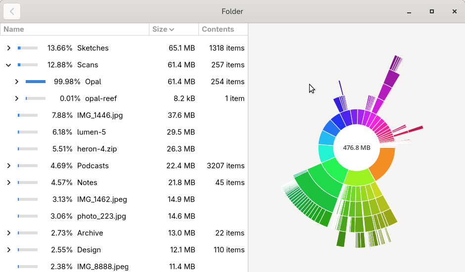

# du-baobab


> WARNING: This application has been 99% written by AI. The idea and guidance was
> provided by me, but the code is more or less entirely generated by Claude as an
> experiment into creating apps this way.
>
> The initial application was made from a single screenshot of Baobab and the
> `du` output of the same folder, then refined over further prompts to add
> functionality and fix bugs. The code has not been reviewed or even read by me
> at all, only feature-tested.
>
> The git commits have been created by me, mostly comitted whenever it
> implemented a new feature or fixed a bug.

When my disks run full I like to have a quick visual way to visualize what's
taking up space. From WinDirStat before I switched to Linux and now to Baobab,
they've always provided me with quick insight into what's eating up my precious
bytes. However whenever any of the servers I manage runs out of space I'm
jolted back into the past perusing `du` output. The following application is a
culmination of this frustration and an idea I've had floating about in my head
ever since I encountered this problem. The idea is simple: run `du` on a server
(or any other machine for that matter), copy the file over to my own computer,
and then visualize the output there the same way Baobab does it. This also
allows you to use any of the filtering options `du` offer such as
`--one-file-system`, `--max-depth`, or even `--threshold` although there isn't
much point. For best results use `--all` to get full information about files,
not only directories, and don't use `--human-readable` or other options that
mess too much with the format (the parser doesn't support formats with e.g.
timestamps).

What follows is Claudes own description of the project:

## Claude readme
An interactive, [Baobab](https://apps.gnome.org/Baobab/)-style visualization
of `du` output, written in Nim with [owlkettle](https://github.com/can-lehmann/owlkettle) (GTK 4).

```sh
du -a ~/Documents > docs.du.txt  # -a includes files, not just directories
du_baobab docs.du.txt
du -ab /some/dir | du_baobab --block-size=1
```

Without `-a`, du only reports directories; the space taken by files directly
inside a directory is shown as a grey `(files)` entry.

### Building

Requires GTK 4 development files.

```sh
nimble build
nimble test
```

### Layout

| File | Purpose |
| --- | --- |
| `src/du_baobab.nim` | CLI entry point |
| `src/du_baobab/dutree.nim` | Parses du output into a `DuNode` tree |
| `src/du_baobab/format.nim` | Size / percentage formatting (SI units, like Baobab) |
| `src/du_baobab/rings.nim` | Rings chart geometry and hit testing (no GTK) |
| `src/du_baobab/ringchart.nim` | Cairo rendering of the rings chart |
| `src/du_baobab/sortablecolumnview.nim` | Owlkettle's `ColumnView` with sortable headers |
| `src/du_baobab/app.nim` | Owlkettle UI |

### Interaction

- Hover a segment to see its name and size in the centre.
- Click a segment, or double-click a list row (or press Enter), to open that directory.
- Click a column header to sort by it; click again to reverse the order.
- Click the arrow next to a folder to expand it in the list.
- Click the centre, or the back button, to go to the parent directory.
